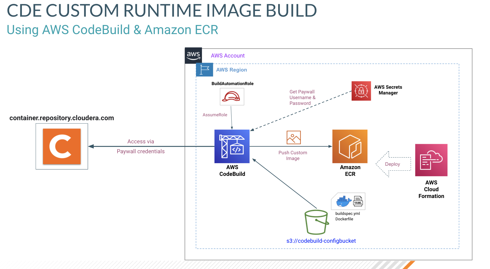
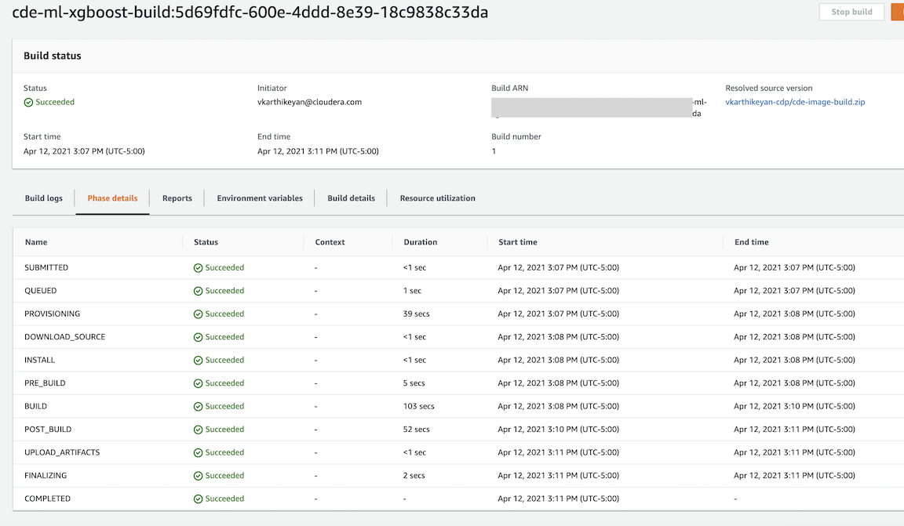
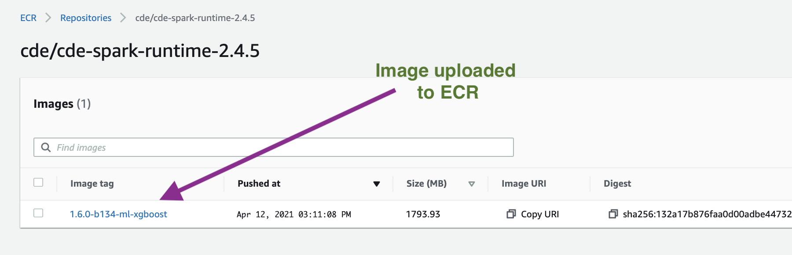

# CDE custom runtime image build with AWS ECR & CodeBuild 
The below steps will pull the CDE image from `container.repository.cloudera.com` and build a custom image based on the `Dockerfile` provided and will upload the custom image to Amazon ECR using AWS CodeBuild.



# Steps
## Setup ECR & IAM role using AWS CloudFormation
- The CloudFormation template cloudformation-ecr-codebuild.yml creates the Amazon Elastic Container Repository and the IAM role required for AWS CodeBuild.
- Update the files `cloudformation-ecr-codebuild.yml`, `cloudformation-parameters.json` & `cloudformation-tags.json` as required.
- Create the Cloudformation stack using the following command
```
aws cloudformation create-stack \
    --stack-name vkar-ecr \
    --template-body file://cloudformation-ecr-codebuild.yml \
    --parameters file://cloudformation-parameters.json \
    --tags file://cloudformation-tags.json \
    --capabilities CAPABILITY_NAMED_IAM 
```
- (If required) To update the stack using change sets, use the following commands
```
aws cloudformation create-change-set \
        --stack-name vkar-ecr \
        --change-set-name change1 \
        --template-body file://cloudformation-ecr-codebuild.yml \
        --parameters file://cloudformation-parameters.json  \
        --tags file://cloudformation-tags.json \
        --capabilities CAPABILITY_NAMED_IAM

aws cloudformation execute-change-set --change-set-name change1 --stack-name vkar-ecr
```

## Modify the AWS CodeBuild config files
- Update the `Dockerfile` with the required customization to the base image. The base image for the docker file will be provided by the `aws-codebuild.json` file.
- Modify the `aws-codebuild.json` file with the updates for the environment.
- The parameters `SOURCE_REPO_USERNAME` and `SOURCE_REPO_PASSWORD` in the `aws-codebuild.json` file specify the AWS Secrets Manager secret. You can embed the username & password here are specify the secret name here.
- Quickly review the `buildspec.yml` file. In general, no changes will be needed here.

## Build the custom image using AWS CodeBuild
- Zip up the `Dockerfile` & `buildspec.yml` (with no root directory) and upload them to the s3 bucket specififed in `aws-codebuild.json`.
- Create the CodeBuild project using the following command
    ```
    aws codebuild create-project --cli-input-json file://aws-codebuild.json
    ```
- Run the build using the following command
    ```
    aws codebuild start-build --project-name cde-ml-xgboost-build
    ```
- You can customize `aws-codebuild.sh` to automate the above steps.

## Screenshots
### AWS CodeBuild

### Amazon ECR



## Run CDE job with the custom runtime image
- First create a resource of type `custom-runtime-image`
    ```
    cde resource create --type="custom-runtime-image" \
        --image-engine="spark2" \
        --name="cde-runtime-ml" \
        --image="123456789012.dkr.ecr.us-west-2.amazonaws.com/cde/cde-spark-runtime-2.4.5:ml-xgboost"
    ```
- Create a job using the newly created resource
    ```
    cde job create --type spark --name ml-scoring-job \
        --runtime-image-resource-name cde-runtime-ml \
            --application-file ./ml-scoring.py \
            --num-executors 30 \
            --executor-memory 4G \
        --driver-memory 4G
    ```
- Execute the job
    ```
    cde job run --name ml-scoring-job
    ```


## CDE Upgrade scenario  
!!! NOT TESTED !!! 
If you are looking to update the resource names for a CDE upgrade, 
use the script `cde-runtime-image-update.sh`